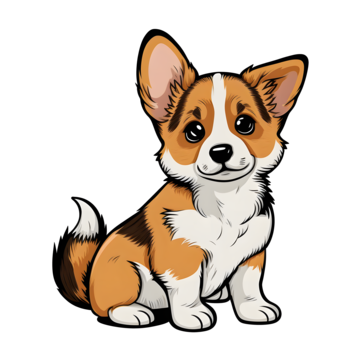

## PetConnect

<div style="text-align:center">
  
</div>

PetConnect is an animal adoption site modeled after PetFinder. Users can look through thousands of pets that are up for adoption, as well as search for pets that meet their exact specifications. There is also a foster component to PetConnect, where individuals can sign up to foster animals and organizations can search for available fosters in specific cities. Complete with user authentication and a working database built with SQLAlchemy, PetConnect's sole purpose is to support animal adoption.

## Prerequisites

- Node.js
- npm
- Python 3
- pip
- This repository cloned on your local machine

## Installation

1. Clone this repository to your local machine

```bash
git clone https://github.com/ricardomerlin/PetConnect.git
```

2. Navigate to the PetConnect directory.

3. Cd into frontend, run `npm install`

4. Travel back to the PetConnect directory and then cd into backend. Run `pipenv install`.

## Running the Application

Cd into frontend and run `npm run dev`. Using the concurrently package, this runs both the frontend and backend servers.